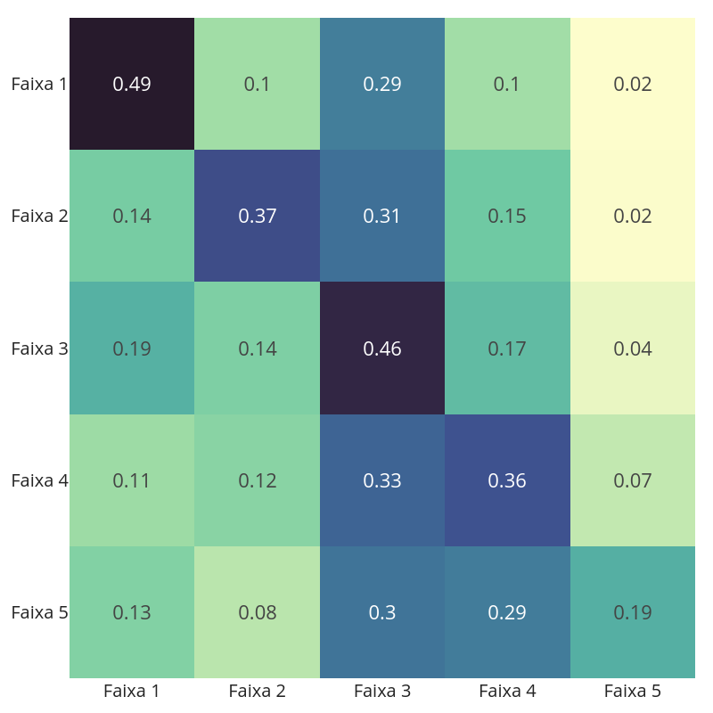
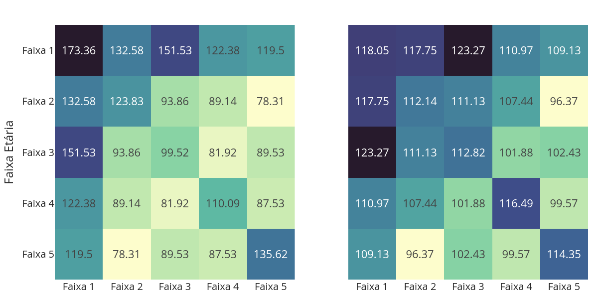
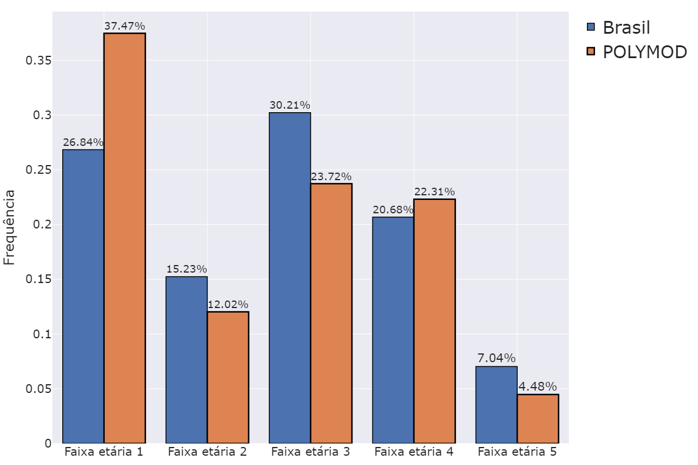
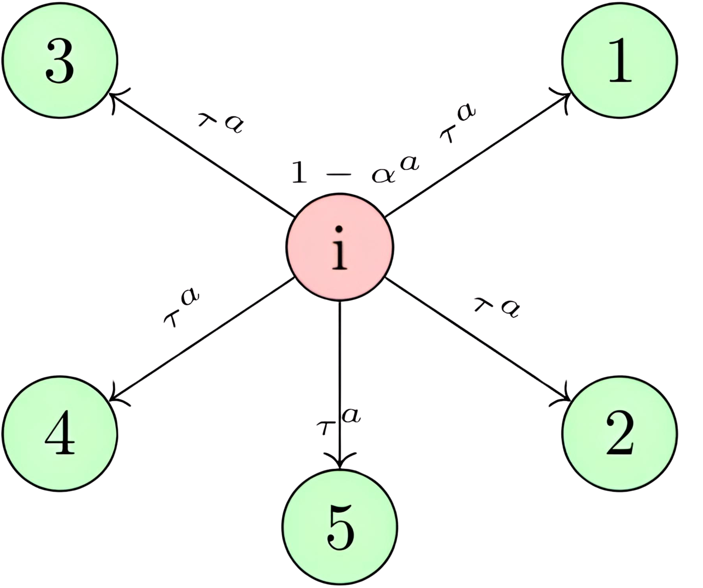
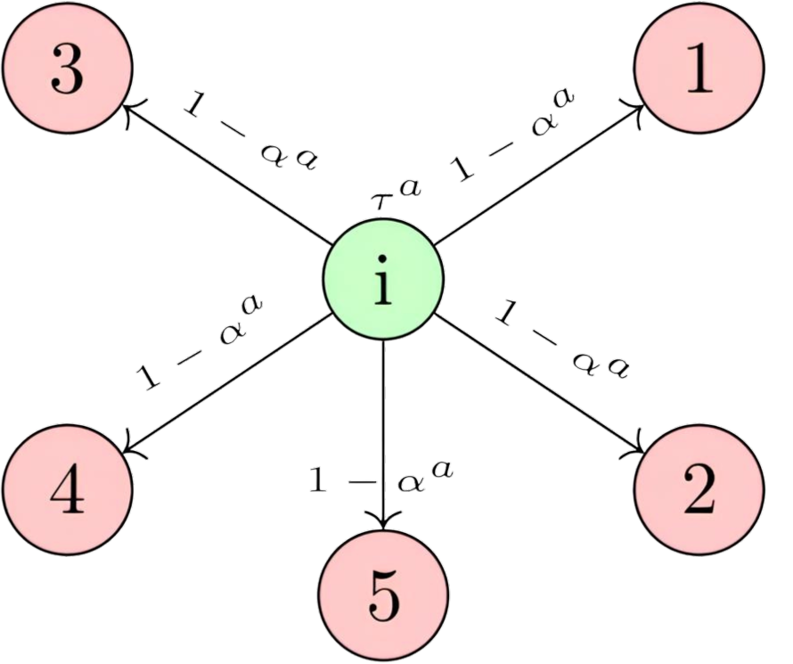

## Análise de estratégias de vacinação para COVID-19 baseada em redes complexas

---
# CONTEXTO DO COVID

- Disseminação do vírus e alta taxa de mortalidade
- Custos elevados e tempo para desenvolvimento de vacinas
    - Pesquisa
    - Armazenamento
    - Distribuição
- Portanto urge a necessidade de estratégias eficientes de vacinação!!!

---
# Modelo de Infecção Proposto

    

---

# COLETA DE DADOS - REDE

- Em 2008, a Comissão Europeia criou o projeto POLYMOD para estudar padrões de contatos na Europa.
- Questionários via ligações aleatórias ou entrevistas em 8 países europeus.
    - Informações pessoais e ambientais (escola, trabalho, casa, etc.).
    - Detalhes sobre contatos físicos diários (idade, duração, frequência).
        
https://socialcontactdata.org/

---
# COLETA DE DADOS - REDE

---

## COLETA DE DADOS - REDE

---

## COLETA DE DADOS - REDE

---

# Coleta de dados - COVID
- Coletado dados de diversos artigos da literatura e do OpenDataSus.
- Distribuição de faixa etária foi utilizada a do Brasil.

---

# Simulação

- A simulação dura 465 dias;
- No dia 100 são vacinados uma fração da população que estejam no estágio Suscetível, Recuperados, Assintomáticos ou Expostos;
- Se ainda sim sobrar vacinas os outros sítios serão vacinados quando entrarem naqueles compartimentos.
- A simulação foi realizada para uma rede de tamanho 10.000 com 400 redes diferentes.

---
# Vacinação 

- Foram usadas mais de 30 estratégias baseadas em centralidades para redes sem ponderação nas arestas e mais de 60 para redes com ponderação;
- Foram utilizadas 3 métricas: Fração de Mortos, Tempo Total Hospitalizado e Fração de Infectados;
- Para centralidades que usam pesos nos nós foram utilizadas duas abordagens: Altruísta e Individualista.
---
# Vacinação 

   
    

        <h2>Altruísta</h2>
        
    

    

        <h2>Individualista</h2>
        
    

---

# Resultados

---
# Contribuições

- Investigação de métricas de centralidade para identificar indivíduos chave na propagação do COVID-19
- Proposição de um modelo de rede considerando conexões entre diferentes faixas etárias
- Desenvolvimento de um modelo de propagação da COVID-19 mais complexo
- Redução significativa da mortalidade e hospitalizações com estratégias baseadas em PageRank ponderado

---

# Desafios

- Limitações na abrangência dos dados do POLYMOD para diferentes países e culturas;
- Necessidade de explorar o impacto da superlotação de hospitais no modelo epidemiológico proposto;
- Avaliação da eficácia das estratégias de vacinação em diferentes cenários epidemiológicos;
- As métricas de centralidade são alteradas com remoções dos nós.

