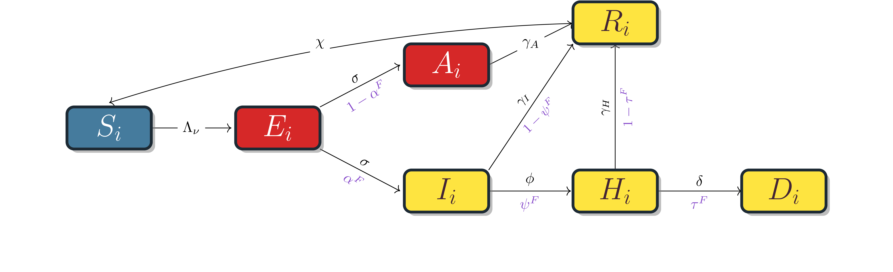
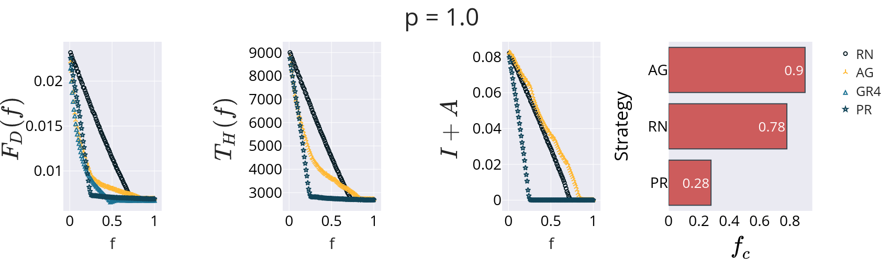

## Analysis of COVID-19 Vaccination Strategies Based on Complex Networks

---
# COVID CONTEXT

- Virus spread and high mortality rate
- High costs and time required for vaccine development:
    - Research
    - Storage
    - Distribution
- Therefore, efficient vaccination strategies are urgently needed!!!

---
# Proposed Infection Model

    

---
# DATA COLLECTION - NETWORK

- In 2008, the European Commission created the POLYMOD project to study contact patterns in Europe.
- Surveys conducted via random calls or interviews in 8 European countries:
    - Personal and environmental information (school, work, home, etc.).
    - Details about daily physical contacts (age, duration, frequency).

https://socialcontactdata.org/

---
# DATA COLLECTION - NETWORK
*The POLYMOD project (2005-2006, 8 European countries) provides valuable empirical data from contact diaries.
    *   Collected participant age, contact's age, interaction time.
    *   Sample representative but oversampled younger age groups.
* POLYMOD data yields ego-centric networks (star graphs), not a complete population contact graph, posing a challenge for direct network modeling.

---

*   **Methodology (Manzo & van der Rijt):** A synthetic network is generated using:
    1.  **Stratified Configuration Model:** Assigns node degrees based on POLYMOD's mean daily contacts, matching the empirical degree distribution.
    2.  **Triadic Closure:** Enhances clustering by connecting neighbors with probability `p`.
*   **Outcome:** The parameter `p` adjusts clustering, creating networks with realistic local structures.

---

## DATA COLLECTION - NETWORK

---

## DATA COLLECTION - NETWORK

---
# Data Collection - COVID

- Data collected from various literature articles and OpenDataSus.
- Age group distribution used was based on Brazil's population.

---
# Simulation

- The simulation lasts 465 days;
- On day 100, a fraction of the population in the Susceptible, Recovered, Asymptomatic, or Exposed stages is vaccinated;
- If vaccines remain, other sites will be vaccinated as they enter those compartments.
- The simulation was conducted on a network of size 10,000 with 400 different networks.

---
# Vaccination

- More than 30 strategies based on centralities were used for networks without edge weights, and more than 60 for networks with edge weights;
- Three metrics were used: Fraction of Deaths, Total Hospitalization Time, and Fraction of Infected;
- For centralities that use node weights, two approaches were applied: Altruistic and Individualistic.

---
# Vaccination

   
    

        <h2>Altruistic</h2>
        
    

    

        <h2>Individualistic</h2>
        
    

---

**Altruistic** Prioritizes nodes likely to cause severe outcomes in neighbors.
- $f_\rightarrow(\Theta(\nu)) = 1-\alpha_\nu$ (P(Node $\nu$ becomes Asymptomatic))
- $f_\leftarrow(\Theta(\mu)) = \tau_\mu$ (P(Neighbor $\mu$ Dies if Symptomatic))

**Individualistic** Prioritizes nodes whose own risk is high, considering neighbors' potential to transmit.
- $f_\rightarrow(\Theta(\nu)) = \tau_\nu$ (P(Node $\nu$ Dies if Symptomatic))
- $f_\leftarrow(\Theta(\mu)) = 1-\alpha_\mu$ (P(Neighbor $\mu$ becomes Asymptomatic))

---

$\small \mathit{UT}(\nu) = \sum\limits_{\mu \in \eta(\nu)} \left( \frac{w_{\nu,\mu}f_\rightarrow(\Theta(\nu))}{k^w_\nu}+\frac{w_{\nu,\mu}f_\leftarrow(\Theta(\mu))}{k^w_\mu} + \frac{w_{\nu,\mu}f_\rightarrow(\Theta(\nu))}{k^w_\nu}\times \frac{w_{\nu,\mu}f_\leftarrow(\Theta(\mu))}{k^w_\mu} \right)$

$\small \mathit{GR}(\nu) =\sum\limits_{\mu \neq \nu}\frac{f_\rightarrow(\Theta(\nu)) f_\leftarrow(\Theta(\mu))}{(d_{\nu,\mu}^w)^{1/s}}$

$\small \mathit{DA}(\nu) = (1-\alpha_\nu) \times \left( 1-\prod\limits_{\mu\in \eta(\nu)} (1-\alpha_\mu\psi_\mu\tau_\mu) \right)$

$\small \mathit{DD}(\nu) = |\eta(\nu)|\alpha_\nu\psi_\nu\tau_\nu$

$\small \mathit{HA}(\nu) = (1-\alpha_\nu) \times \left( 1-\prod\limits_{\mu\in \eta(\nu)} (1-\psi_\mu) \right)$

---

*   **Goal:** Evaluate effectiveness of different node prioritization strategies for vaccination.
*   **Metrics:**
    1.  **Total Hospitalization Time ($T_H$)**: Area under $T_H(f)$.
    2.  **Fraction of Deaths ($F_D$)**: Area under $F_D(f)$.
    3.  **Fraction to Extinguish ($f_c$)**: Min fraction $f$ for disease eradication.
    *   Also used mean normalized rank across metrics.
*   **Strategies:** Compared centrality-based (37 simple, 63 weighted/attribute-aware), Age-based (AG), and Random (RN).

---

*   **Age (AG):** Poor for extinction ($f_c \approx 90\%$, worse than RN), but reduces deaths/hospitalization at low $f$ (<15%).
*   **PageRank (PR):** Excellent for extinction ($f_c \approx 30\%$). Best on average.
*   **Best vary by metric:** Gravity (GR4), Utility (UT), PageRank (PR).

---

*   Findings consistent for p=1 (higher clustering).
*   AG still poor for $f_c$.
*   PR still strong, best on average.
*   Specific best strategies remain similar.

---

*   Some shifts in best performers (e.g., Gravity variants, Weighted Laplacian, Weighted PageRank).
*   **Weighted PageRank (WPR)** is best on average for p=0.
*   AG strategy shows similar patterns (poor $f_c$, decent low-$f$ $F_D$/$T_H$).

---

*   **Unweighted PageRank (PR)** emerges as best on average for p=1, even on the weighted network.
*   Overall, PageRank variants consistently perform well.

---

## Metric Correlations & Clustering Robustness

---

---

*   **Metric Correlation:**
    *   $T_H$ and $F_D$ rankings are strongly correlated.
    *   $f_c$ shows weak correlation with $F_D$, explaining AG's behavior.
*   **Clustering Robustness:**
    *   Strategy rankings remain consistent across different `p` values.
    *   **Conclusion:** Strategy effectiveness is largely unaffected by clustering, ensuring real-world applicability.

---

*   **Using Edge Weights in Centrality:**
    *   Relative Difference: $Z^w = (M^{w} - M) / M$
    *   **Finding:** Generally little benefit, often *worse* performance using weighted centrality measures. Closeness showed ~150% loss.
    *   **Conclusion:** The computational cost of weighted centrality may not be justified.
*   **Altruistic vs. Egoistic Measures:**
    *   Relative Difference: $Z^A = (M^{E} - M^{A}) / M^{A}$
    *   **Finding:** Egoistic strategies generally perform worse on weighted networks. Little difference on unweighted networks.

---

---

---

## Key Takeaways

1.  **Pre-vaccination dynamics:** Stabilize around day 100, providing a start point for interventions. Clustering (`p`) and edge weights have minor impact *before* vaccination.
2.  **Age Prioritization:** Generally **not** optimal for minimizing overall impact ($f_c$), though effective for reducing deaths/hospitalization at very low coverage (<15%).
3.  **PageRank:** Consistently a top-performing strategy, especially for disease extinction ($f_c$), robust across network structures (p=0, p=1, weighted/unweighted).
4.  **Metric Choice Matters:** Best strategy depends on the objective ($T_H$, $F_D$, or $f_c$). $T_H$ and $F_D$ are correlated, $f_c$ behaves differently.
5.  **Robustness:** Strategy rankings are largely robust to network clustering (`p`).
6.  **Weighted Centralities:** Offer little benefit and can decrease performance; likely not worth the computational cost.
7.  **Altruistic Measures:** Tend to outperform egoistic ones when node attributes are used on weighted networks.

---
# Contributions

- Investigation of centrality metrics to identify key individuals in the spread of COVID-19
- Proposal of a network model considering connections between different age groups
- Development of a more complex COVID-19 propagation model
- Significant reduction in mortality and hospitalizations with strategies based on weighted PageRank

---

# Challenges

- Limitations in the scope of POLYMOD data for different countries and cultures;
- Need to explore the impact of hospital overcrowding in the proposed epidemiological model;
- Evaluation of the effectiveness of vaccination strategies in different epidemiological scenarios;
- Centrality metrics are altered with node removals.

