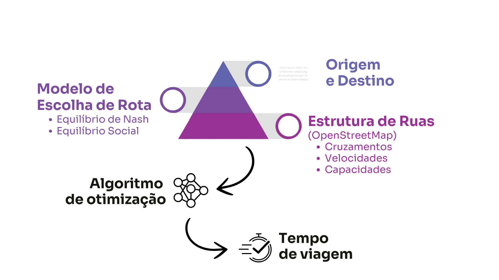

# Estimação de Matrizes OD - Revisão Bibliográfica
- Carlos Miguel Moreira Gonçalves

---
## Simulação de Tráfego

---

## Coleta de Artigos

- Foram coletados 53 artigos do Google Scholar
    - Utilizando a tag "origin destination matrix estimation";
    - Não foram selecionados artigos que usavam informações além do fluxo ou tempo;
    - Foram recolhidos artigos até a 3 página pelo crítério de título;
    - Foram coletados artigos nas seguintes faixas: até 2000, 2000 a 2010 e 2010 até atual;
    - 11 foram descartados após a lida.

---

---

- A pesquisa atual sobre estimação de ODs não foca mais em algoritmos.
- Em 2010 houve a chegada do ML na estimação
- Dificuldade em pesquisar o que eu exatamente quero;
- Parece que a estimação de ODs evoluiu separado de TA
---

## Principais Métodos de Estimação de Matrizes OD Utilizando Fluxo na Rede

1. **Método de Entropia Máxima (ME)**
    - Baseado na teoria da informação.
    - Maximiza a entropia sujeita a restrições de fluxo observadas.

2. **Método de Mínimos Quadrados (LS)**
    - Minimiza a soma dos quadrados das diferenças entre os fluxos observados e estimados.
    - Simples e eficiente, mas pode não capturar bem a variabilidade dos dados.

---
## Principais Métodos de Estimação de Matrizes OD Utilizando Fluxo na Rede

3. **Método do Gradiente (Network Equilibrium)**
    - Baseado na teoria de equilíbrio de tráfego.
    - Assume que os motoristas escolhem rotas para minimizar o tempo de viagem.

4. **Método de Máxima Verossimilhança (ML)**
    - Maximiza a probabilidade dos fluxos observados dados os parâmetros do modelo.
    - Requer uma boa modelagem estatística dos dados.

---

### Método de Máxima Verossimilhança

Admite-se que $T_i$ segue uma distribuição de Poisson com parâmetro $\lambda = p_i \times \hat{T_i}$.

A função de verossimilhança para uma distribuição de Poisson é dada por:

$$
L(p_i \times \hat{T_i}; T_i) = \prod_{i=1}^{n} \frac{e^{-p_i \times \hat{T_i}} (p_i \times \hat{T_i})^{T_i}}{T_i!}
$$

  Spiess, Heinz. A maximum likelihood model for estimating origin-destination matrices. Transportation Research Part B: Methodological

---

Para maximizar a verossimilhança, tomamos o logaritmo da função de verossimilhança:

$$
\min \log L(p_i \times \hat{T_i}; T_i) = \sum_{i=1}^{n} \left( p_i \times \hat{T_i} - T_i \log ( \hat{T_i})\right)
$$

$$
\sum_{i=1}^{n} \delta_{i,a} T_i = v_a
$$

onde $\delta_{i,a}$ é uma variável indicadora que vale 1 se a OD $i$ contribui para o arco $a$ e 0 caso contrário, e $v_a$ é o fluxo observado no arco $a$.

  Spiess, Heinz. A maximum likelihood model for estimating origin-destination matrices. Transportation Research Part B: Methodological

---
### Método de Lagrange

Para resolver o problema de estimação de matrizes OD utilizando o método de Lagrange, introduzimos multiplicadores de Lagrange $\lambda_a$ para cada restrição de fluxo observada.

A função Lagrangiana é dada por:

$$
\mathcal{L}(p_i \times \hat{T_i}, \lambda_a) = \log L(p_i \times \hat{T_i}; T_i) + \sum_{a} \lambda_a \left( \sum_{i=1}^{n} \delta_{i,a} T_i - v_a \right)
$$

  Spiess, Heinz. A maximum likelihood model for estimating origin-destination matrices. Transportation Research Part B: Methodological

---
## Passo 0

- Inicialize $\lambda_a \leftarrow 0, a \in A$.
- Defina $s_i \leftarrow \rho_i, i \in I$.

  Spiess, Heinz. A maximum likelihood model for estimating origin-destination matrices. Transportation Research Part B: Methodological

---

### Passo 1

Para cada $a \in A$:

1. Calcule 

   $$
   d_a^{\min} = -\min_{i \in I, \ n_{ia} > 0} \frac{s_i}{n_{ia}}
   $$

   e defina $I'$ como o conjunto de pares O-D para os quais este mínimo é atingido.

  Spiess, Heinz. A maximum likelihood model for estimating origin-destination matrices. Transportation Research Part B: Methodological

---

### Passo 1 (continuação)

2. Se $I' \subset I^o$ e 

   $$
   \sum_{i \in I^+} \frac{n_{ia} t_i}{s_i + n_{ia} d_a^{\min}} \leq V_a
   $$

   então defina $d_a \leftarrow d_a^{\min}$, 

   senão encontre $d_a > d_a^{\min}$ que satisfaça:

   $$
   \sum_{i \in I^+} \frac{n_{ia} t_i}{s_i + n_{ia} d_a} = V_a
   $$

  Spiess, Heinz. A maximum likelihood model for estimating origin-destination matrices. Transportation Research Part B: Methodological

---

### Passo 1 (continuação)

3. Atualize:

   - $\lambda_a \leftarrow \lambda_a + d_a$
   - $s_i \leftarrow s_i + n_{ia} d_a, \quad i \in I$.

  Spiess, Heinz. A maximum likelihood model for estimating origin-destination matrices. Transportation Research Part B: Methodological

---

## Passo 2

Se $|| d || > \epsilon$, volte ao **Passo 1**.

Caso contrário, compute:

$$
T_i^* = \frac{t_i}{s_i}, \quad \text{para todos } i \in I \text{ com } s_i > 0.
$$

  Spiess, Heinz. A maximum likelihood model for estimating origin-destination matrices. Transportation Research Part B: Methodological

---

## Passo 3

Para $i$ com $s_i = 0$, resolva o seguinte sistema linear:

$$
\sum_{i \in I, \ s_i = 0} n_{ia} T_i = V_a - \sum_{i \in I^+} n_{ia} T_i^*, \quad a \in A.
$$

Com as condições:

- $T_i \geq 0$ para todos $i \in I^o$ com $s_i = 0$.

  Spiess, Heinz. A maximum likelihood model for estimating origin-destination matrices. Transportation Research Part B: Methodological

---
1. Esse problema matemático é convexo;
2. Precisa saber a priori uma estimativa da matriz OD.
3. Precisa-se saber, quando foi proposto, da matriz $n_{i,a}$

  Aerde, Michel Van, Hesham Rakha, and Harinarayan Paramahamsan. "Estimation of origin-destination matrices: Relationship between practical and theoretical considerations." Transportation Research Record 1831.1 (2003): 122-130.

---
<!-- Slide 2 -->
### Método do Gradiente

$$
Z(\hat{T}) \;=\; \frac{1}{2} \,\sum_{a \in \hat{A}} \bigl[v_a(\hat{T}) - \hat{v}_a\bigr]^2,
$$

- $\hat{T}$: vetor de demandas OD (para todos os pares Origem-Destino $i \in I$).  
- $v_a(g)$: volume estimado no link $a$ quando se atribui $g$.  
- $\hat{v}_a$: volume observado no link $a$.  
- $\hat{A}$: conjunto de links com contagem observada.

  Spiess, Heinz. "A gradient approach for the OD matrix adjustment problem." a∈ ˆA

---

<!-- Slide 3 -->

Para cada par OD $i$, podemos ter um conjunto de rotas $k$. O volume em cada link $a$:

$$
v_a \;=\; \sum_{i \in I} \sum_{k \in K_i} \delta_{a k} \, h_k,
$$

onde:
- $\delta_{a k} = 1$ se o link $a$ pertence à rota $k$, e $0$ caso contrário.  
- $h_k$: fluxo na rota $k$.

  Spiess, Heinz. "A gradient approach for the OD matrix adjustment problem." a∈ ˆA

---

Se definirmos a **probabilidade** de rota $p_k = h_k / g_i$, obtemos:

$$
v_a \;=\; \sum_{i \in I} g_i \sum_{k \in K_i} \delta_{a k}\, p_k.
$$

  Spiess, Heinz. "A gradient approach for the OD matrix adjustment problem." a∈ ˆA

<!-- Slide 4 -->

O gradiente de $Z$ em relação à demanda $g_i$:

$$
\frac{\partial Z}{\partial g_i}
\;=\;
\sum_{a \in \hat{A}}
\frac{\partial v_a}{\partial g_i}
\bigl[v_a - \hat{v}_a\bigr].
$$
---
Supondo $p_k$ localmente constantes (isto é, não variam instantaneamente com $g_i$), temos:

$$
\frac{\partial v_a}{\partial g_i}
\;=\;
\sum_{k \in K_i} \delta_{a k}\, p_k.
$$

Logo,

$$
\frac{\partial Z}{\partial g_i}
\;=\;
\sum_{a \in \hat{A}}
\sum_{k \in K_i}
\delta_{a k}\, p_k\,
\bigl[v_a - \hat{v}_a\bigr].
$$

  Spiess, Heinz. "A gradient approach for the OD matrix adjustment problem." a∈ ˆA

---

<!-- Slide 5 -->

Para cada iteração $\ell$, queremos atualizar $g_i$ no **sentido** de maior declive negativo.  
Forma multiplicativa (evita alterar zeros e considera variação percentual):

$$
g_i^{(\ell+1)}
\;=\;
g_i^{(\ell)}
\Bigl(
\,1 \;-\; \lambda^{(\ell)} \,\frac{\partial Z}{\partial g_i}
\Bigr),
$$

onde $\lambda^{(\ell)}$ é o **tamanho de passo** a ser escolhido na iteração $\ell$.

  Spiess, Heinz. "A gradient approach for the OD matrix adjustment problem." a∈ ˆA

---

<!-- Slide 6 -->

Para achar o **tamanho de passo ótimo** $\lambda$, precisamos do valor $v'_a = \tfrac{d\,v_a}{d\,\lambda}$.  
Pelo critério da regra da cadeia:

$$
v'_a
\;=\;
\frac{d\,v_a}{d\,\lambda}
\;=\;
\sum_{i \in I}
\frac{d\,g_i}{d\,\lambda}
\;\frac{\partial v_a}{\partial g_i}.
$$

Como $\frac{d\,g_i}{d\,\lambda} = -\,g_i \,\frac{\partial Z}{\partial g_i}$
na direção de descida multiplicativa, obtemos:

$$
v'_a
\;=\;
-\sum_{i \in I}
g_i
\Bigl(\sum_{k \in K_i}\!\delta_{a k}\,p_k\Bigr)\!
\Bigl(\!\sum_{a' \in \hat{A}}
\delta_{a' k}\,\bigl[v_{a'} - \hat{v}_{a'}\bigr]\Bigr).
$$

  Spiess, Heinz. "A gradient approach for the OD matrix adjustment problem." a∈ ˆA

---

<!-- Slide 7 -->

Queremos minimizar $Z$ ao longo da direção de descida. A derivada de $Z$ em função de $\lambda$:

$$
\frac{d\,Z(\lambda)}{d\,\lambda}
=
\sum_{a \in \hat{A}}
v'_a
\Bigl(
[v_a - \hat{v}_a] + \lambda\,v'_a
\Bigr).
$$

Encontrando o ponto ótimo $\lambda^*$ (onde esta derivada se anula):

$$ 
\lambda = \frac{\sum_{a \in A} v_a'(\hat{v_a} - v_a) } { \sum_{a \in A} v_a^{'2} }
$$

  Spiess, Heinz. "A gradient approach for the OD matrix adjustment problem." a∈ ˆA

---

<!-- Slide 8 -->

1. **Inicia** com $g^{(0)}$ (matriz OD inicial).
2. Atribui na rede $\rightarrow$ obtém $v_a^{(\ell)}$.
3. Calcula $\frac{\partial Z}{\partial g_i}$ para cada $i$.
4. Estima $\lambda^{(\ell)}$ usando a fórmula acima.
5. **Atualiza** $g_i^{(\ell+1)} = g_i^{(\ell)} \bigl[1 - \lambda^{(\ell)}\, \frac{\partial Z}{\partial g_i}\bigr]$.
6. Repete até convergência ou limite de iterações.

  Spiess, Heinz. "A gradient approach for the OD matrix adjustment problem." a∈ ˆA

---

1. **Dependência de da posição inicial**  

2. **Custo Computacional**  

3. **Problema mal posto**

4. **Admite equilíbrio** 

  Kolovský, František, and Ivana Kolingerová. "Origin-destination matrix estimation using bush-based user equilibrium algorithms." International Conference on Computational Science and Its Applications.

---

## GLS

- **Objetivo**: Estimar a matriz Origem–Destino $\mathbf{t}$ a partir de:
  1. **Estimativa prévia** $\boldsymbol{\tau}$ (vinda de pesquisa ou modelo), com covariância $\mathbf{V}$.
  2. **Contagens de tráfego** $\mathbf{f}_{obs}$ em links da rede, com covariância $\mathbf{W}$.
  3. **Assignment** (matriz $\mathbf{A}$ relacionando $\mathbf{t}$ e os fluxos).

  Cascetta, Ennio. "Estimation of trip matrices from traffic counts and survey data: a generalized least squares estimator." Transportation Research Part B: Methodological.

---

## 2. Relação entre as Variáveis

A relação entre $\boldsymbol{\tau}$, $\mathbf{f}_{obs}$ e $\mathbf{t}$ é dada por:

1. $\boldsymbol{\tau} = \mathbf{t} + \mathbf{c}$, onde $\mathrm{E}[\mathbf{c}] = \boldsymbol{\mu}$ e $\mathrm{Var}(\mathbf{c}) = \mathbf{V}$.
2. $\mathbf{f}_{obs} = \mathbf{A}\,\mathbf{t} + \boldsymbol{\varepsilon}$, onde $\mathrm{E}[\boldsymbol{\varepsilon}] = \boldsymbol{\delta}$ e $\mathrm{Var}(\boldsymbol{\varepsilon}) = \mathbf{W}$.

  Cascetta, Ennio. "Estimation of trip matrices from traffic counts and survey data: a generalized least squares estimator." Transportation Research Part B: Methodological.

---

## 3. Sistema Linear Estocástico

Juntamos as observações $\boldsymbol{\tau}$ e $\mathbf{f}_{obs}$ no seguinte sistema linear:

$$
\begin{pmatrix}
\boldsymbol{\tau} \\
\mathbf{f}_{obs}
\end{pmatrix}
=
\begin{pmatrix}
\mathbf{I} \\
\mathbf{A}
\end{pmatrix}
\mathbf{t}
+ 
\begin{pmatrix}
\mathbf{c} \\
\boldsymbol{\varepsilon}
\end{pmatrix},
\quad
\text{com covariâncias}
\quad
\mathbf{B} =
\begin{pmatrix}
\mathbf{V} & \mathbf{0} \\
\mathbf{0} & \mathbf{W}
\end{pmatrix}.
$$

  Cascetta, Ennio. "Estimation of trip matrices from traffic counts and survey data: a generalized least squares estimator." Transportation Research Part B: Methodological.

---

## 4. Função-Objetivo do GLS

A função-objetivo do GLS é minimizar a diferença ponderada entre as observações e a estimativa de $\mathbf{t}$:

$$
(\mathbf{y} - \mathbf{X}\mathbf{t})^\top \mathbf{B}^{-1} (\mathbf{y} - \mathbf{X}\mathbf{t}),
$$
onde $\mathbf{y} = \begin{pmatrix} \boldsymbol{\tau} \\ \mathbf{f}_{obs} \end{pmatrix}$ e $\mathbf{X} = \begin{pmatrix} \mathbf{I} \\ \mathbf{A} \end{pmatrix}$.

  Cascetta, Ennio. "Estimation of trip matrices from traffic counts and survey data: a generalized least squares estimator." Transportation Research Part B: Methodological.

---

## 5. Solução Fechada

A solução do estimador GLS para $\mathbf{t}$ é dada por:

$$
\hat{\mathbf{t}} = \left(\mathbf{V}^{-1} + \mathbf{A}^\top \mathbf{W}^{-1}\mathbf{A}\right)^{-1} \left(\mathbf{V}^{-1}\boldsymbol{\tau} + \mathbf{A}^\top \mathbf{W}^{-1}\mathbf{f}_{obs}\right).
$$

  Cascetta, Ennio. "Estimation of trip matrices from traffic counts and survey data: a generalized least squares estimator." Transportation Research Part B: Methodological.

---

## 6. Viés e Covariância

- **Viés**: Se $\boldsymbol{\mu} \neq \mathbf{0}$ ou $\boldsymbol{\delta} \neq \mathbf{0}$, o estimador pode ser viesado.
- **Covariância**: A variância do estimador é dada por:

$$
\mathrm{Var}(\hat{\mathbf{t}}) = \left(\mathbf{V}^{-1} + \mathbf{A}^\top \mathbf{W}^{-1}\mathbf{A}\right)^{-1}.
$$

  Cascetta, Ennio. "Estimation of trip matrices from traffic counts and survey data: a generalized least squares estimator." Transportation Research Part B: Methodological.

---

## 7. Vantagens do GLS

1. **Integração de informações**: Combina estimativas prévias e contagens de tráfego de forma eficiente.
2. **Flexibilidade**: Não depende de uma distribuição específica (como Poisson), apenas das matrizes de covariância $\mathbf{V}$ e $\mathbf{W}$.
3. **Fórmula direta**: Oferece uma solução fechada para $\hat{\mathbf{t}}$ quando o assignment é simples.

  Cascetta, Ennio. "Estimation of trip matrices from traffic counts and survey data: a generalized least squares estimator." Transportation Research Part B: Methodological.

---

## 8. Desvantagens do GLS

1. **Necessidade de estimar $\mathbf{V}$ e $\mathbf{W}$**: Essas matrizes podem ser difíceis de estimar corretamente.
2. **Viés**: O estimador pode ser viesado se a estimativa prévia $\boldsymbol{\tau}$ ou a matriz de assignment $\mathbf{A}$ forem imprecisas.
3. **Assignment não linear**: Se o assignment depender da própria O–D (equilíbrio de tráfego), o modelo se torna não linear.

  Cascetta, Ennio. "Estimation of trip matrices from traffic counts and survey data: a generalized least squares estimator." Transportation Research Part B: Methodological.

---
### Máxima Entropia
$$
\max \sum_{r,s} \left( x_{rs} \ln(x_{rs}) - x_{rs} \right)
$$

$$
\sum_{k \in K_{rs}} f_{k_{rs}} \delta_{a,k} = v_a \quad \forall a \in A \quad f_{k_{rs}} \geq 0
$$

- $f_{k_{rs}}$: Fluxo de caminho \(k\) entre \(r\) e \(s\).
- $v_a$: Fluxo observado no link \(a\).
- $x_{rs}$ é o número de viagens entre os pares origem \(r\) e destino \(s\).

  Spiess, Heinz. "A maximum likelihood model for estimating origin-destination matrices." Transportation Research Part B: Methodological

---
### Passos Detalhados do Algoritmo

1. **Inicialização**:
   - Definir uma matriz O-D inicial $x_{rs}^0$.
   - A inicialização pode ser feita atribuindo $x_{rs} = \hat{v}_a$ para os links da sub-rede, e $x_{rs} = 0$ para os outros pares origem-destino $(r, s)$.

---
   - Resolver o **problema linearizado** do modelo de Máxima Entropia (ME):
   
   $$
   \min \sum_{r,s} \left( \sum_{k \in K_{rs}} f_{k_{rs}} \ln f_{k_{rs}} - f_{k_{rs}} \right)
   $$
   
   Sujeito a:
   
   $$
   \sum_{k \in K_{rs}} f_{k_{rs}} \delta_{a,k} = \hat{v}_a \quad \forall a \in A
   $$
   
   Onde $f_{k_{rs}}$ é o fluxo do caminho $k$ entre os pares O-D $(r, s)$, e $\delta_{a,k}$ é o indicador de incidência do link $a$ no caminho $k$.

---

3. **Busca de Linha**:
   - Encontre o valor ótimo de $\alpha$ (um parâmetro de mistura) resolvendo:
   
   $$
   \min \left( \sum_{r,s} \left( x_{rs} \ln x_{rs} - x_{rs} \right) + \alpha \sum_{r,s} \left( y_{rs} \ln y_{rs} - y_{rs} \right) \right)
   $$
   
   Aqui, $y_{rs}$ é a matriz auxiliar de viagens obtida no Passo 1.

  Spiess, Heinz. "A maximum likelihood model for estimating origin-destination matrices." Transportation Research Part B: Methodological

---
4. **Atualização da Solução**:
   - Atualize a matriz O-D $x_{rs}$ com base no valor de $\alpha$:
   
   $$
   x_{rs}^{n+1} = x_{rs}^n + \alpha (y_{rs} - x_{rs}^n)
   $$
   
   Onde $x_{rs}^n$ é a matriz O-D na iteração $n$, e $y_{rs}$ é a solução auxiliar obtida no Passo 1.

  Spiess, Heinz. "A maximum likelihood model for estimating origin-destination matrices." Transportation Research Part B: Methodological

---

5. **Teste de Convergência**:
   - Verifique se a solução convergiu, ou seja, se a mudança entre as iterações foi suficientemente pequena:
   
   $$
   \| x_{rs}^{n+1} - x_{rs}^n \| < \epsilon
   $$
   
   Caso o critério de convergência seja atendido, pare. Caso contrário, retorne ao Passo 1.

  Spiess, Heinz. "A maximum likelihood model for estimating origin-destination matrices." Transportation Research Part B: Methodological

---

## Vantagens

- **Eficiência Computacional**: Evita a enumeração completa de caminhos, usando geração de colunas.
- **Escalabilidade**: Adequado para redes grandes, com muitos nós e links.
- **Solução Viável**: Sempre gera uma solução viável, desde que haja dados de fluxo.

---

## Desvantagens

- **Dependência de Fluxos Precisos**: A precisão depende dos dados de fluxo nos links.
- **Complexidade em Redes Muito Grandes**: A busca de caminhos curtos pode ser um gargalo em redes muito grandes.
- **Não Considera Custos de Viagem**: Não incorpora explicitamente variáveis de custo de viagem, como tempo ou congestionamento.
- **Matriz de Incidência**: Necessita saber a priori.
---
### Modelagens recentes
- Modelagens mistas

$$
F(g,v) = \gamma_1 \mathbf{F}_1 (g, \hat{g}) + \gamma_2 \mathbf{F}_2 (v, \hat{v})
$$

- Modelagens com Machine Leraning
- Metaheruísticas

---

### Modelagem de Matrizes OD com ML

- Utilização de técnicas de Machine Learning para estimar matrizes OD.
- Aplicação de modelos como Redes Neurais, Regressão, e Árvores de Decisão.
- Integração de dados de diversas fontes, como sensores de tráfego e dados de GPS.
- Melhoria na precisão das estimativas em comparação com métodos tradicionais.
- Capacidade de adaptação a diferentes cenários e condições de tráfego.

---

- Divide a matriz OD em dois tensores (R e C) que representam características latentes de origens e destinos.

- Modela a sequência temporal desses tensores usando redes recorrentes (GRU/LSTM) combinadas com convolução em grafos (GCNN).

- Reconstrói a matriz OD multiplicando R e C, depois usa softmax para normalizar e obter histogramas de probabilidade.

    Hu, Jilin, et al. "Stochastic origin-destination matrix forecasting using dual-stage graph convolutional, recurrent neural networks." 2020 IEEE 36th International conference on data engineering (ICDE). IEEE, 2020.

   

---

- Cada matriz $M^{(t)}$ é fatiada por origem ou destino.
- Aplicamos **GCNN** com matrizes de adjacência (W, W') para considerar vizinhança espacial.
- Geramos tensores menores **R** e **C** que capturam características latentes.

- Substituímos as camadas totalmente conectadas de uma GRU por **filtros de convolução em grafos**.
- Cada iteração da GRU considera **vizinhos** das regiões, explorando dependências **espaciais e temporais**.

    Hu, Jilin, et al. "Stochastic origin-destination matrix forecasting using dual-stage graph convolutional, recurrent neural networks." 2020 IEEE 36th International conference on data engineering (ICDE). IEEE, 2020.

   

---

- Para cada passo futuro \(t+h\):
  1. Previsão de $\widehat{R}^{(t+h)}$ e $\widehat{C}^{(t+h)}$ pela GCNN-RNN.
  2. Multiplicação: $\widetilde{M}^{(t+h)} = \widehat{R}^{(t+h)} \times \widehat{C}^{(t+h)}$.
  3. **softmax** para garantir que cada célula seja um histograma (probabilidades somando 1).

    Hu, Jilin, et al. "Stochastic origin-destination matrix forecasting using dual-stage graph convolutional, recurrent neural networks." 2020 IEEE 36th International conference on data engineering (ICDE). IEEE, 2020.

---

- $\mathbf{t}$: vetor ou matriz de viagens OD reais (a desconhecida).  
- $\mathbf{\bar{t}}$: estimativa inicial (alvo).  
- $\mathbf{f}$: fluxos em cada link resultantes de $ \mathbf{t} $.  
- $\mathbf{\bar{f}}$: contagens de tráfego medidas em alguns links.  

- Custo no link $\ell$: $c_\ell = c_\ell(f_\ell)$.  
- **Equilíbrio** (por exemplo, SUE - Stochastic User Equilibrium):
  - Fração de $\mathbf{t}$ que escolhe um caminho $k$ depende de $c_k$.  
  - $\mathbf{f}$ é resultado da soma de fluxos de todos os caminhos e OD.  

---

Minimizar uma medida de desvio entre: $\mathbf{t}$ e $\mathbf{\bar{t}}$ e $\mathbf{f}(\mathbf{t})$ e $\mathbf{\bar{f}}$

Por exemplo, via Mínimos Quadrados Generalizados (GLS):

$$
\min_{\mathbf{x}\ge 0} 
\; (\mathbf{x} - \mathbf{\bar{t}})^\mathsf{T} V^{-1} (\mathbf{x} - \mathbf{\bar{t}})
\;+\;
(\mathbf{\bar{f}} - \mathbf{f}(\mathbf{x}))^\mathsf{T} W^{-1} (\mathbf{\bar{f}} - \mathbf{f}(\mathbf{x})).
$$

- $\mathbf{f}(\mathbf{x})$ requer resolver o equilíbrio (pois $\mathbf{c} = \mathbf{c}(\mathbf{f})$).  
- Logo, a solução final $\mathbf{t}^*$ satisfaz um **ponto fixo**:$\mathbf{t}^* = T[\mathbf{f}(\mathbf{t}^*)]$,
  isto é, “atribuindo $\mathbf{t}^*$ na rede (equilíbrio), e voltando ao problema de mínimos quadrados, obtemos de novo $\mathbf{t}^*$”.

---

1. Dado $\mathbf{t}^{(k-1)}$, resolva o **equilíbrio** (DUE/SUE)  
   - Obtenha $\mathbf{f}^{(k)}$ e custos $\mathbf{c}^{(k)}$.  
2. Resolva o subproblema de mínimos quadrados (ou outro critério) fixando a matriz de atribuição do passo anterior.  
   - Obtenha $\mathbf{t}^{(k)}$.  
3. Se $\|\mathbf{t}^{(k)} - \mathbf{t}^{(k-1)}\|$ < tolerância, parar. Caso contrário, repetir.

---

- Iniciar: $k=0$ e $\mathbf{t}^{(0)} = \mathbf{\bar{t}}$.  
- Resolver a atribuição (SUE) para $\mathbf{t}^{(0)}$. Obter $\mathbf{f}^{(0)}, \mathbf{c}^{(0)}, H^{(0)}$.

- Resolver:
  $$
    \mathbf{x}^{(k)} 
    = 
    \arg\min_{\mathbf{x}\ge 0} 
    \bigl[
      F_1(\mathbf{x}, \mathbf{\bar{t}}) + F_2(H^{(k-1)}\,\mathbf{x}, \mathbf{\bar{f}})
    \bigr].
  $$
- Definir $\mathbf{t}^{(k)} = \mathbf{x}^{(k)}$.  

- Atribuir $\mathbf{t}^{(k)}$ $\to$ resolver SUE, obter $\mathbf{f}^{(k)}$ e $H^{(k)}$.  
- Se convergiu, parar. Senão, $k \leftarrow k+1$ e repetir.

---

- Resolver o subproblema e obter $\mathbf{x}^{(k)}$.  
- Fazer uma média com $\mathbf{t}^{(k-1)}$:

   $$
   \mathbf{t}^{(k)}
     = 
     \alpha_k\,\mathbf{x}^{(k)} + (1 - \alpha_k)\,\mathbf{t}^{(k-1)},
   $$

   onde geralmente $\alpha_k = \tfrac{1}{k}$ ou outra sequência decrescente.  
3. Atribuir $\mathbf{t}^{(k)}$, etc.

---

